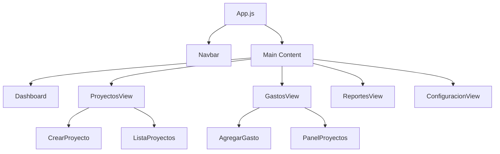

# 📁 Estructura del Proyecto - Frontend

## 🏗️ Nueva Arquitectura Implementada

La aplicación ha sido reorganizada siguiendo las mejores prácticas de arquitectura React, separando claramente **Views** (páginas/vistas) de **Components** (componentes reutilizables).

## 📂 Estructura de Carpetas

```
frontend/src/
├── components/          # 🧩 Componentes reutilizables
│   ├── AgregarGasto.jsx
│   ├── CrearProyecto.jsx
│   ├── ListaProyectos.jsx
│   └── PanelProyectos.jsx
├── views/              # 📄 Vistas/Páginas principales
│   ├── Dashboard.jsx
│   ├── Dashboard.css
│   ├── ProyectosView.jsx
│   ├── ProyectosView.css
│   ├── GastosView.jsx
│   ├── GastosView.css
│   ├── ReportesView.jsx
│   ├── ReportesView.css
│   ├── ConfiguracionView.jsx
│   └── ConfiguracionView.css
├── services/           # 🔧 Servicios (Firebase, API)
│   └── firebase.js
├── App.js             # 🎯 Componente principal con navegación
├── App.css            # 🎨 Estilos del layout principal
└── index.js           # 🚀 Punto de entrada
```

## 🎯 Principios de la Nueva Arquitectura

### 📄 Views (Vistas)
**Ubicación:** `src/views/`
- **Propósito:** Páginas completas de la aplicación
- **Responsabilidad:** Orquestar componentes y manejar estado de página
- **Naming:** `[Nombre]View.jsx` + `[Nombre]View.css`

**Vistas implementadas:**
- `Dashboard.jsx` - Resumen ejecutivo con métricas
- `ProyectosView.jsx` - Gestión completa de proyectos
- `GastosView.jsx` - Control de gastos por proyecto
- `ReportesView.jsx` - Análisis y reportes avanzados
- `ConfiguracionView.jsx` - Configuración de la aplicación

### 🧩 Components (Componentes)
**Ubicación:** `src/components/`
- **Propósito:** Piezas reutilizables de UI
- **Responsabilidad:** Funcionalidad específica y reutilizable
- **Naming:** `[Nombre].jsx`

**Componentes reutilizables:**
- `CrearProyecto.jsx` - Formulario de creación de proyectos
- `ListaProyectos.jsx` - Lista y gestión de proyectos
- `AgregarGasto.jsx` - Formulario para agregar gastos
- `PanelProyectos.jsx` - Panel de control de proyectos

## 🔄 Flujo de Navegación



## 🎨 Sistema de Estilos

### Convenciones CSS:
- **Cada vista** tiene su propio archivo CSS
- **BEM methodology** para nombres de clases específicas
- **CSS Variables** para colores y tamaños consistentes
- **Glassmorphism design** con backdrop-filter y transparencias

### Paleta de Colores por Vista:
- **Dashboard:** Azul/Púrpura (`#667eea`, `#764ba2`)
- **Proyectos:** Azul/Púrpura (`#667eea`, `#764ba2`)
- **Gastos:** Rojo/Naranja (`#e74c3c`, `#c0392b`)
- **Reportes:** Azul/Púrpura (`#3498db`, `#9b59b6`)
- **Configuración:** Gris/Azul oscuro (`#95a5a6`, `#34495e`)

## 🔧 Características Técnicas

### State Management:
- **Local State** con `useState` en cada vista
- **Props drilling** controlado entre views y components
- **Firebase** como fuente de verdad para datos persistentes

### Responsividad:
- **Mobile-first** approach
- **Breakpoints:** 480px, 768px, 1024px
- **Grid/Flexbox** para layouts adaptativos

### Performance:
- **Code splitting** por vista (implementable con React.lazy)
- **Memoización** de componentes pesados
- **Optimistic updates** en operaciones CRUD

## 🚀 Ventajas de esta Arquitectura

### ✅ Escalabilidad
- Fácil agregar nuevas vistas
- Componentes reutilizables entre vistas
- Mantenimiento independiente por sección

### ✅ Mantenibilidad
- Separación clara de responsabilidades
- Código más legible y organizado
- Testing independiente por módulo

### ✅ Developer Experience
- Estructura predecible
- Imports claros y organizados
- Hot reload más eficiente

## 📈 Próximas Mejoras Sugeridas

1. **Lazy Loading:** Implementar carga diferida de vistas
2. **Context API:** Para estado global (usuario, configuración)
3. **Custom Hooks:** Abstraer lógica repetitiva
4. **Error Boundaries:** Manejo de errores por vista
5. **Testing:** Tests unitarios por componente/vista

## 🔍 Cómo Agregar Nueva Funcionalidad

### Para agregar una nueva vista:
1. Crear `src/views/NuevaVista.jsx`
2. Crear `src/views/NuevaVista.css`
3. Importar en `App.js`
4. Agregar case en `renderizarVista()`
5. Agregar botón en navbar

### Para agregar un nuevo componente:
1. Crear `src/components/NuevoComponente.jsx`
2. Implementar como componente reutilizable
3. Importar en las vistas que lo necesiten
4. Documentar props y funcionalidad

---

**✨ Esta estructura garantiza un código limpio, escalable y fácil de mantener para el crecimiento futuro de la aplicación.** 